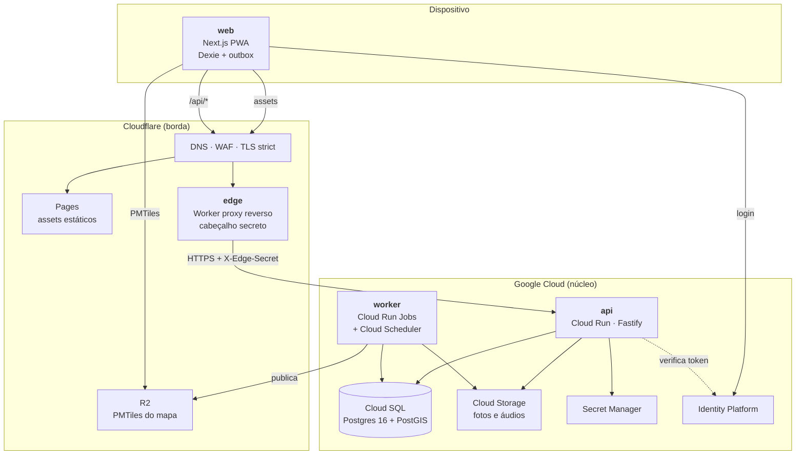
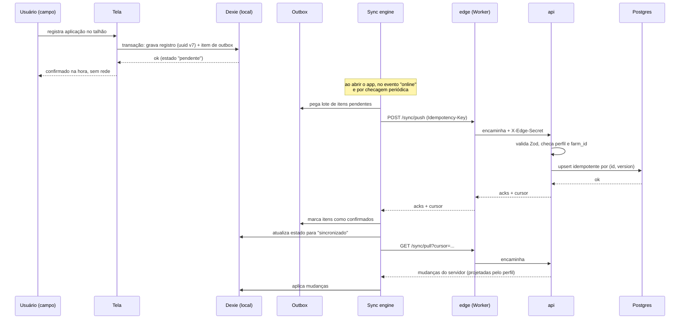
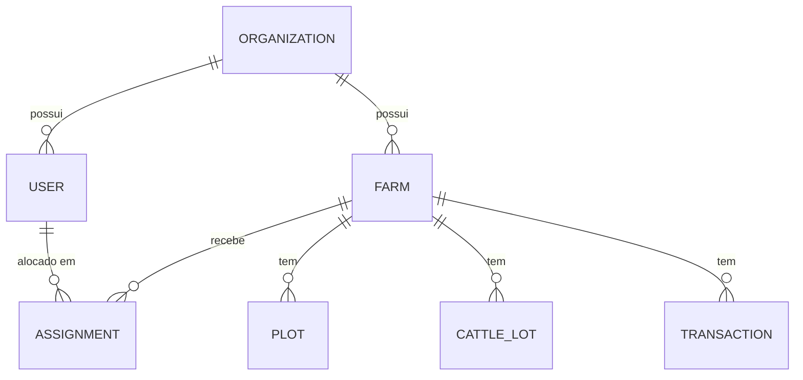
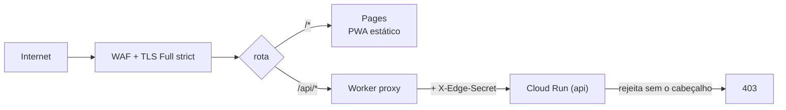
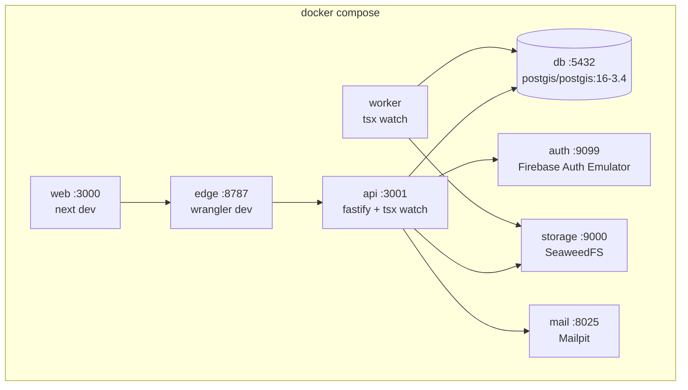

# Arquitetura

Documento vivo. Decisões que o alteram viram ADR em `specs/adr/`.

---

## 1. Visão geral

Quatro serviços, separados **por tipo de carga** — não por domínio. O domínio é
separado dentro da API, como monólito modular (ADR-0003).



| Serviço  | Onde roda                          | Responsabilidade                                                                                  |
| -------- | ---------------------------------- | ------------------------------------------------------------------------------------------------- |
| `web`    | Cloudflare Pages (export estático) | PWA offline-first, em duas superfícies. Toda leitura e escrita passa pelo Dexie.                  |
| `api`    | Cloud Run                          | Monólito modular Fastify. Autorização, validação, cálculos, protocolo de sync.                    |
| `worker` | Cloud Run Jobs + Scheduler         | Trabalho pesado e agendado: importação de planilhas, relatórios, NDVI, clima, geração de PMTiles. |
| `edge`   | Cloudflare Worker                  | Proxy reverso para a API. Único caminho público até o Cloud Run.                                  |
| `agent`  | _Fase 2_                           | Assistente agronômico via Vertex AI, com tools. Não existe ainda.                                 |

## 2. Fronteiras

O `web` tem **duas superfícies sobre o mesmo código**: a de **campo**, mobile-first,
para o operador no curral e no talhão; e a de **escritório**, densa e operada por
teclado, para a digitação em série de quem recebe a informação do campo (ADR-0015).
Mesmo domínio, mesmo Dexie, mesma outbox, mesma checagem de perfil e fazenda — muda só
o desenho da tela.

- `web` **nunca** fala com `api` direto de um componente. A camada de dados é Dexie; a
  sincronização é um serviço à parte.
- `api` é o **único** processo que escreve no Postgres em resposta a requisição de
  usuário. `worker` também escreve, mas só em fluxos batch, reutilizando os mesmos
  módulos de domínio.
- Contratos compartilhados (schemas Zod, tipos, protocolo de sync) vivem em
  `packages/shared` e são a única dependência comum entre `web`, `api` e `worker`.
- O Cloud Run da API **não aceita tráfego público direto**: só requisições com o
  cabeçalho secreto injetado pelo Worker de borda (ADR-0006).

---

## 3. Fluxo de dados de um lançamento



### Regras do protocolo

| Aspecto              | Decisão                                                                                           |
| -------------------- | ------------------------------------------------------------------------------------------------- |
| Identidade           | UUID v7 gerado no cliente (ADR-0009)                                                              |
| Idempotência         | `Idempotency-Key` por lote + upsert por `(id, version)` no servidor                               |
| Ordem                | A outbox é FIFO por entidade; dependências (lote antes do animal) respeitam a ordem de criação    |
| Conflito — eventos   | Não conflitam. Aplicação, pesagem e colheita são fatos append-only.                               |
| Conflito — cadastros | Last-write-wins por `updated_at`, com o valor sobrescrito guardado no histórico de alterações     |
| Retry                | Backoff exponencial com teto; item que falha por validação vai para `failed` e aparece ao usuário |
| Projeção             | O `pull` devolve apenas o que o perfil pode ver. Operador não recebe tabela financeira.           |
| Mídia                | Foto e áudio entram na outbox como item próprio, comprimidos antes do upload                      |

### Offline no iOS

iOS não tem Background Sync nem Periodic Background Sync. A estratégia:

- sincronizar ao abrir o app (`visibilitychange` → visível);
- sincronizar no evento `online`;
- checagem periódica enquanto o app está em primeiro plano;
- pedir `navigator.storage.persist()` no primeiro uso, para o Safari não descartar o
  IndexedDB por pressão de armazenamento;
- contador de pendências sempre visível, para o usuário saber que precisa abrir o app
  em área com sinal.

### Cache do PWA

| Recurso                 | `Cache-Control`                                |
| ----------------------- | ---------------------------------------------- |
| `sw.js`, `index.html`   | `no-cache`                                     |
| assets com hash no nome | `public, max-age=31536000, immutable`          |
| PMTiles no R2           | `public, max-age=86400` + revalidação por ETag |

---

## 4. Multi-fazenda e visibilidade



Toda tabela de negócio carrega `organization_id` e `farm_id` (constitution §3). O
escopo de acesso é resolvido em **uma única camada**, antes do domínio:

```
requisição → verifica token → resolve perfil e fazendas acessíveis
           → injeta AccessScope { organizationId, farmIds, role }
           → módulo de domínio recebe o escopo já resolvido
```

| Perfil     | Fazendas        | Dados financeiros                   | Escrita                                      |
| ---------- | --------------- | ----------------------------------- | -------------------------------------------- |
| `owner`    | todas           | sim, inclusive consolidado do grupo | tudo                                         |
| `manager`  | todas           | sim                                 | lança, edita, aprova, gera relatórios        |
| `operator` | só onde alocado | **nunca**                           | só operacional; pode entrar como "a revisar" |

A restrição do operador é aplicada na **camada de dados** — a projeção por perfil
acontece na consulta, não na serialização. O agente `sync-auditor` verifica isso.

---

## 5. Borda Cloudflare



- O Worker injeta `X-Edge-Secret` (Secret do Worker). A API rejeita qualquer requisição
  sem ele. A URL do Cloud Run não é divulgada.
- Sem **challenge/CAPTCHA** nas rotas `/api/*`: o cliente é um PWA que sincroniza em
  segundo plano e não resolve desafio.
- **R2** serve apenas artefato público derivado: os PMTiles do mapa base. Nenhum dado
  de negócio na borda (constitution §9).

---

## 6. Ambientes

Na Fase 1 há **um único ambiente de nuvem**: o `local` em Docker faz o papel de
desenvolvimento (ADR-0014).

| Ambiente | Onde roda      | Banco                       | Domínio     |
| -------- | -------------- | --------------------------- | ----------- |
| `local`  | Docker Compose | container `postgis`         | `localhost` |
| `prod`   | GCP `fmc-prod` | Cloud SQL com **HA e PITR** | `<dominio>` |

Ambientes adicionais (`dev`, `staging`) entram quando houver dado real em produção,
migração destrutiva a ensaiar, janela de release ou segundo cliente — as condições de
disparo estão no [ADR-0014](adr/0014-um-ambiente-de-nuvem-na-fase-1.md). O tipo
`AppEnv` e o `wrangler.toml` já os aceitam; acrescentar um é criar um diretório em
`environments/`.

Tudo em **Terraform com Terragrunt** ([ADR-0013](adr/0013-terragrunt-sobre-terraform.md)),
com providers Google e Cloudflare, estado separado por componente. Labels de custo por
cliente e alerta de orçamento.

### Ambiente local em Docker

O ambiente local é a **stack completa em containers** (ADR-0010). Cada serviço
gerenciado do GCP tem um stand-in local por trás da **mesma interface** — a troca é
por variável de ambiente, nunca por `if (isLocal)` espalhado no código.



| Produção                          | Local                              | Interface compartilhada                  |
| --------------------------------- | ---------------------------------- | ---------------------------------------- |
| Cloud SQL (Postgres + PostGIS)    | container `postgis/postgis:16-3.4` | mesma connection string                  |
| Identity Platform / Firebase Auth | Firebase Auth Emulator             | mesmo SDK; `FIREBASE_AUTH_EMULATOR_HOST` |
| Cloud Storage                     | SeaweedFS (API S3)                 | adaptador `ObjectStorage`                |
| Cloudflare R2                     | SeaweedFS, bucket separado         | adaptador `ObjectStorage`                |
| Cloudflare Worker (edge)          | `wrangler dev`                     | mesmo `apps/edge/src/index.ts`           |
| Cloud Run Jobs + Scheduler        | container `worker` em loop         | mesmo `apps/worker/src`                  |
| envio de e-mail                   | Mailpit                            | SMTP                                     |
| Secret Manager                    | `.env` local (não versionado)      | leitor de config em `packages/config`    |

Comandos: `make up`, `make down`, `make logs`, `make migrate`, `make seed`, `make test`.
Detalhes em `README.md`.
